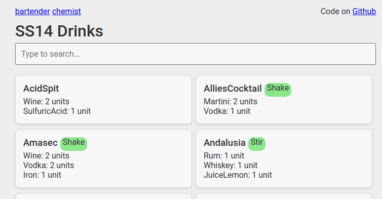

# SS14 Tools

https://aussieguy0.github.io/ss14-tools/bartender/ 

A collection of web-based tools for Space Station 14. Currently, it includes drink and chemical recipes.



## Running locally

1. Install dependencies:
```bash
cd scripts
npm install
```

2. Start the local server (from the scripts directory):
```bash
npm run serve
```

The web interface will be available at `http://localhost:8080`


## Data sources

Data is fetched directly from the SS14 repository. 

Run `npm run fetch` to fetch and process the latest data files.

The following files are used:

- [chemicals.yml](https://raw.githubusercontent.com/space-wizards/space-station-14/master/Resources/Prototypes/Recipes/Reactions/chemicals.yml)
- [medicine.yml](https://raw.githubusercontent.com/space-wizards/space-station-14/master/Resources/Prototypes/Recipes/Reactions/medicine.yml)
- [drinks.yml](https://raw.githubusercontent.com/space-wizards/space-station-14/master/Resources/Prototypes/Recipes/Reactions/drinks.yml)
- [Reagents/medicine.yml](https://raw.githubusercontent.com/space-wizards/space-station-14/master/Resources/Prototypes/Reagents/medicine.yml)
